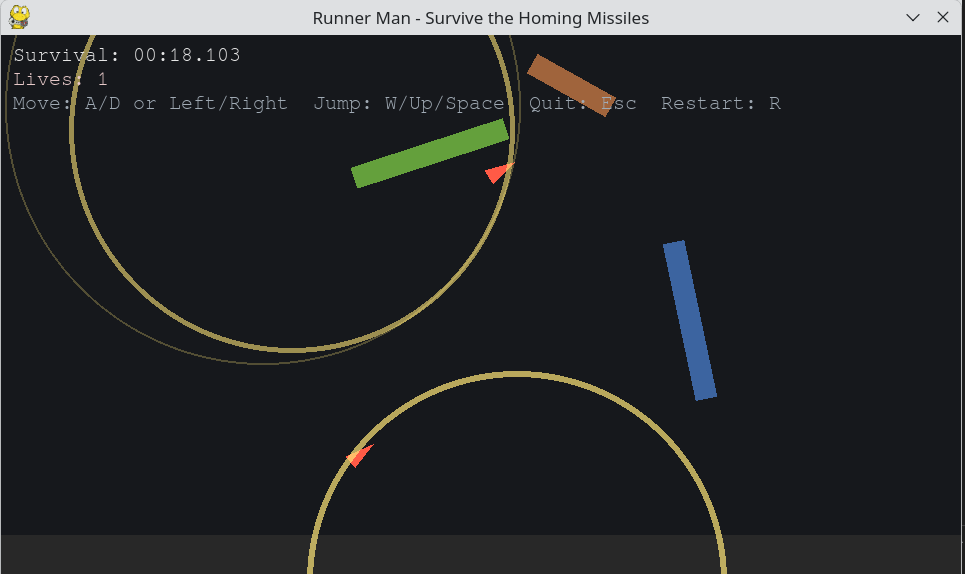

# runner_man

A simple game made with pygame.



To start:
```
# Ensure Python 3.13 is available
uv python install 3.13

# Create a virtual environment using Python 3.13 call it runnerman_venv
uv venv -p 3.13 runnerman_venv
# (optional) activate it: 
source runnerman_venv/bin/activate

# Install project dependencies from pyproject.toml (editable mode so you can edit the code and it will be reflected in the virtual environment)
uv pip install -e .

# Run the game with Python 3.13
uv run -p 3.13 main.py
```

